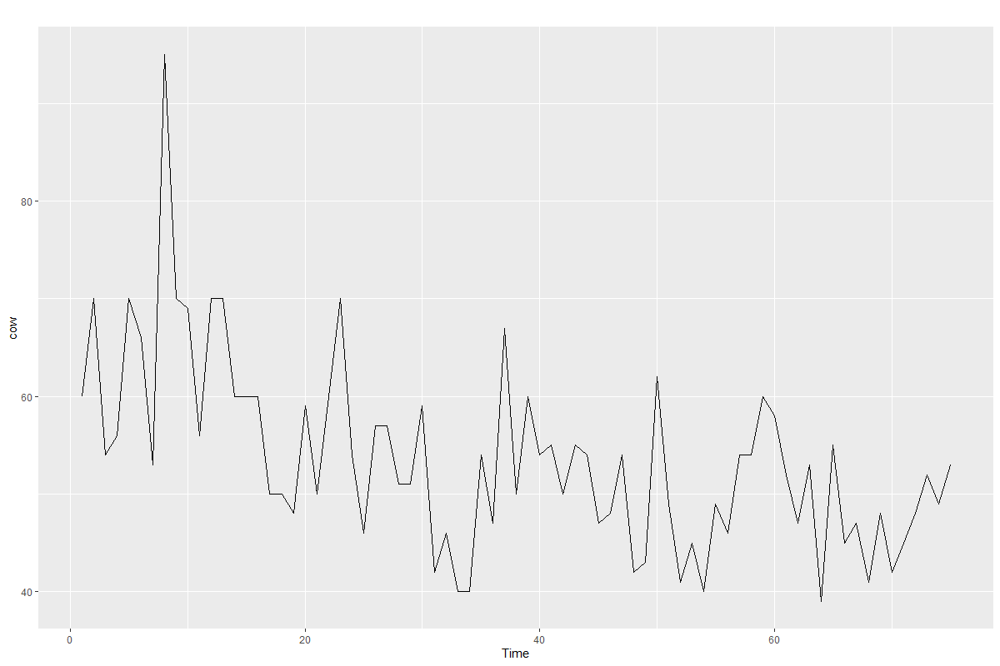
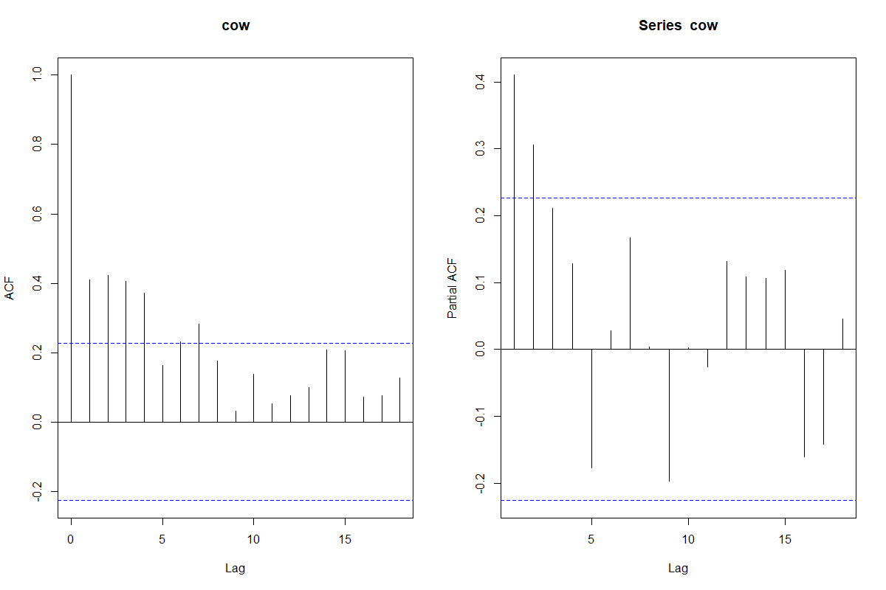
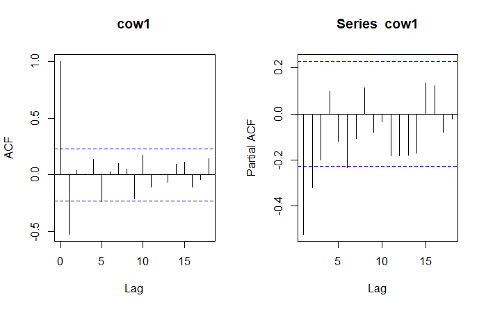
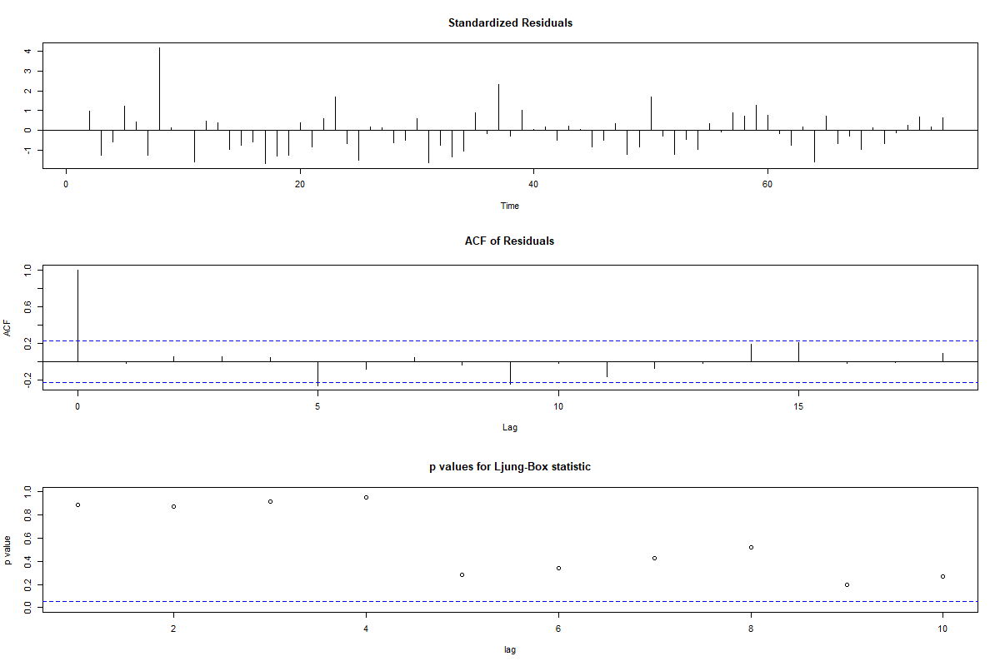
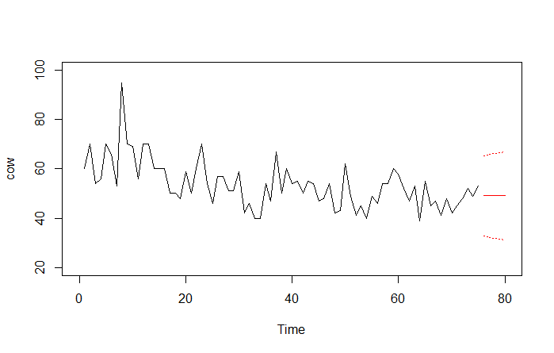

# Time-Series-Analysis-Lab
# 1. “cow.dat” data
First we look at the time plot for the ‘cow.dat’ data. 

The time plot has no abnormalities aside from the one high value and no evidence of
changing variance, so there is no need for data transformation.

## 1.1 Analysis of ACF and PACF

Fig 2.1 ACF and PACF of cow

From the ACF in Fig 2.1, we observe that the data seems to be stationary since the ACF
cutoffs at lag 7. We conduct the augmented Dickey-Fuller test to test for stationarity. 

Fig 2.2 Augmented Dickey-Fuller test for cow

From Fig 2.2, the p-value=0.04933 which is extremely close to the significance level of 0.05,
so it is difficult to reach any conclusions. Thus we perform differencing and take a look at the
ACF and PACF.

Fig 2.3 ACF and PACF of differenced cow

Fig 2.4 Augmented Dickey-Fuller test for differenced cow

From Fig 2.3, the ACF cuts off quickly after lag 1 which implies that the data is now
stationary. This is further confirmed by Fig 2.4 where the Augmented Dickey-Fuller test
returns a p-value smaller than the significance level of 0.05. This suggests using a
differencing of 1 for the ARIMA model.

## 1.2 Parameter Estimation
From Fig 2.3, the ACF cut off after lag 1 suggests ARIMA(0,1,1) model and the PACF cut
off after lag 6 suggests ARIMA(6,1,0) model. Next we use the auto.arima function in R with
a differencing of 1 to decide between the two.

Fig 3.1 Best fitted ARIMA model with differencing of 1

From Fig 3.1, we obtain ARIMA(0,1,1) which confirms our theory so we pick ARIMA(0,1,1)
as our fitted model.

## 1.3 Diagnostic Checking
We perform diagnostic checking of the fitted model by analysing the residuals from the fit for
any signs of non–randomness using the tsdiag function in R and checking for autocorrelation
among the residuals using the Box.plot function.

Fig 3.2 Output from tsdiag

Fig 3.3 Output from Box.test

From Fig 3.2, the standardised residuals seem random and the ACF of residuals and the p-
value of Ljung-Box statistic are within acceptable range. The p-value from the Box-Pierce
test is more than 0.05, so the residuals are not autocorrelated. Thus the ARIMA(0,1,1) model
is adequate.

## 1.4 Prediction of ARIMA model
We do prediction for the next 5 time steps and plot the results with an approximate
confidence interval (95%) of the prediction using “prediction ± 2 × SE”. The confidence
bands are drawn as a red, dotted line. The plot is shown below in Fig 3.4.

Fig 3.4 cow plot and predicted values

